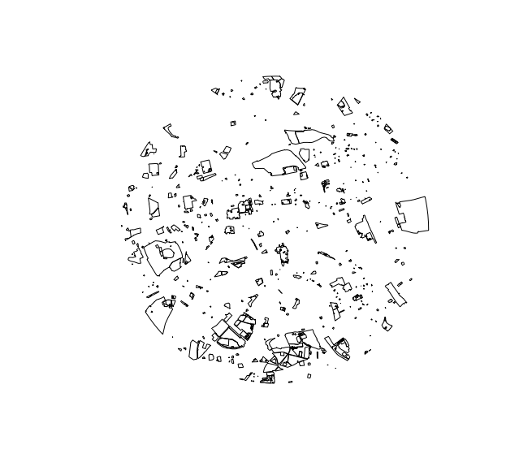

# Who has access to nature 
.center[
 <iframe src="https://giphy.com/embed/L1VRSg6CslKVZoxWBu" width="321" height="480" frameBorder="0" class="giphy-embed" allowFullScreen></iframe>
<a href="https://giphy.com/gifs/L1VRSg6CslKVZoxWBu">via GIPHY</a>

]
---

# green space at ward level 

.center[

]

???
We wanted to calculate this for every ward but it took too long 

---
# working things out at a ward level
.center[
<iframe src="https://giphy.com/embed/3og0IxxiLOjM1e5P0s" width="480" height="227" frameBorder="0" class="giphy-embed" allowFullScreen></iframe>
<a href="https://giphy.com/gifs/zootopia-dmv-3og0IxxiLOjM1e5P0s">via GIPHY</a>

]
---
# combining this with socioeconomic data 

.center[
<iframe src="https://giphy.com/embed/uuQhtq9t4QjuM" width="480" height="360" frameBorder="0" class="giphy-embed" allowFullScreen></iframe>
<a href="https://giphy.com/gifs/uuQhtq9t4QjuM">via GIPHY</a>

]
---
# Pretty maps 

